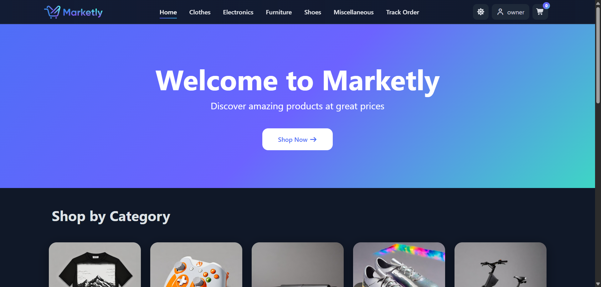
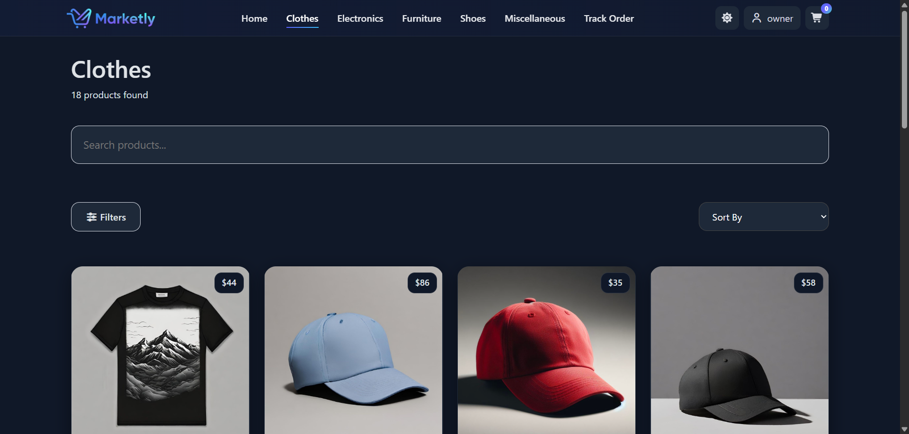
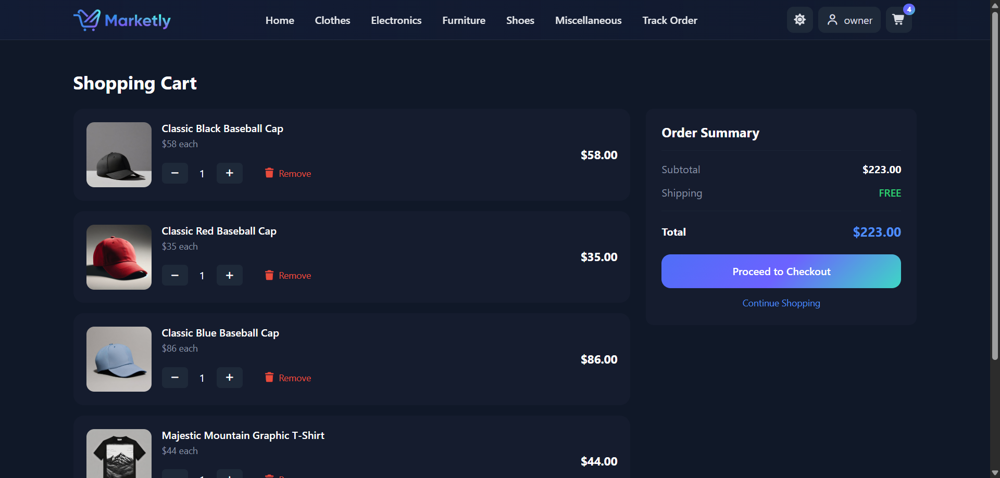
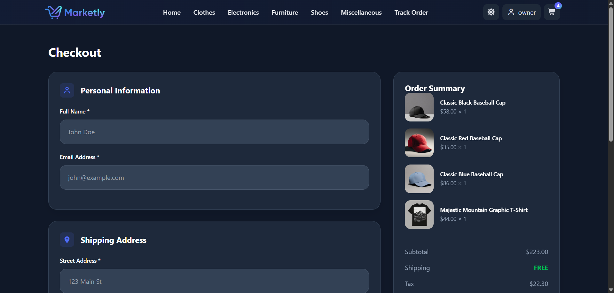
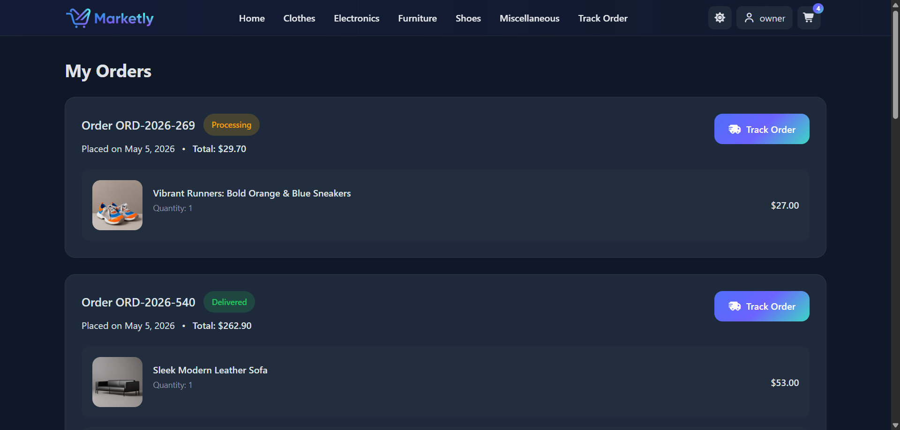
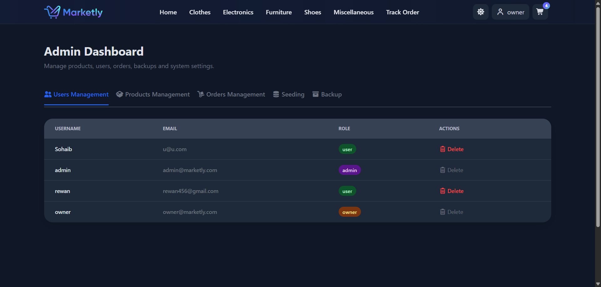

# Marketly

Modern e-commerce web application built with React, Firebase, Redux Toolkit, and Firestore.

## Live Demo

https://marketly-store.vercel.app/

---

## Project Idea

Marketly is a modern e-commerce web application designed to provide a complete online shopping experience for customers while offering powerful management tools for administrators and owners.

The system enables users to browse products, search products, manage shopping carts, place orders, and track purchases. It also provides a centralized administrative dashboard for managing products, categories, users, and orders.

---

## Project Objectives

* Build a modern and responsive e-commerce platform.
* Provide secure user authentication and authorization.
* Simplify product and order management.
* Deliver a seamless shopping experience for customers.
* Utilize cloud-based cloud services for scalability and reliability.
* Provide administrative tools for efficient system management.

---

## Features

### Authentication & Users

* Firebase Authentication
* Guest browsing support
* Persistent user sessions
* User roles (User, Admin, Owner)

### Shopping Experience

* Product catalog
* Categories browsing
* Product details pages
* Search and filtering
* Shopping cart
* Checkout process
* Order tracking
* Order history

### Admin Dashboard

* User Management
* Product Management
* Order Management
* Real-time Firestore updates

### Owner Features

* Backup & Restore system
* Products seeding from Platzi API
* System settings management

### Additional Features

* Dark / Light mode
* Responsive design
* SEO optimization with React Helmet Async
* Toast notifications
* Real-time Firestore synchronization

---

## Technology Stack

### Frontend

* React.js
* JavaScript (ES6+)
* CSS Modules
* Bootstrap
* React Router DOM
* Redux Toolkit
* React Helmet Async
* React Hot Toast
* Formik
* Yup

### Backend Services

* Firebase Authentication
* Cloud Firestore

### External API

* Platzi API (used for products and categories seeding)

### Deployment

* Vercel

---

## System Architecture

Marketly uses Firebase Authentication and Cloud Firestore as the primary backend services.

Although products can be imported from the Platzi API, the application does not rely on Platzi data during normal operation.

Products are imported once and stored in Firestore, allowing the application to:

* Maintain stable product data
* Avoid external API inconsistencies
* Support product management operations
* Keep all modifications synchronized across the platform

Orders are stored entirely in Firestore, which means:

* Orders are available across devices
* Orders persist after logout
* Order tracking uses real database data
* Admins can manage order statuses in real time

Only cart items are temporarily stored in localStorage and are automatically cleared after a successful checkout.

---

## Admin Dashboard

### Users Management

* View registered users
* Remove users from Firestore records

**Note:** Removing a user only deletes the Firestore document. If the same user signs in again, a new record will be automatically created.

### Products Management

* Create products
* Edit products
* Delete products
* Manage product images

All changes are applied directly to Firestore and immediately affect the live website.

### Orders Management

* View all orders
* Inspect order details
* Update order status
* Track customer purchases

---

## Owner Features

### Backup & Restore

Create backups of products and categories collections and restore them when needed.

### Products Seeding

Import products from Platzi API directly into Firestore collections.

### Settings

Manage system-level operations and data synchronization.

---

## Installation

### Clone Repository

## Clone Repository

```bash
git clone https://github.com/ItcProjects-R4/SHR4_SWD6_S1_PROJECT4.git
```

### Navigate to Project Directory

```bash
cd SHR4_SWD6_S1_PROJECT4/Graduation_Project
```

### Install Dependencies

```bash
npm install
```

### Run Development Server

```bash
npm start
```

---

## Project Structure

```text
src/
├── Components/      # Reusable UI components
├── Pages/           # Application pages
├── Context/         # React Context providers
├── Store/           # Redux Toolkit store and slices
├── Services/        # Application services
├── firebase.js      # Firebase configuration
├── App.js           # Main application component
└── index.js         # Application entry point
```

---

## Screenshots

### Home Page



### Products Page



### Shopping Cart



### Checkout Page



### My Orders



### Admin Dashboard



---

## Development Challenges

### Dependency on External API

The project initially relied entirely on the Platzi API as the primary source of products and categories.

To improve reliability and maintain full control over application data, Cloud Firestore was integrated as the primary database.

### Data Backup & Recovery

Administrative modifications could be lost if external data became unavailable or incorrect.

A backup and restore system was implemented to preserve product and category modifications and allow data recovery when necessary.

### Duplicate Orders During Network Interruptions

Users could submit multiple checkout requests while offline, resulting in duplicate orders once the connection was restored.

This issue was resolved through network connectivity validation and request handling controls.

### Product Filtering Issues

Newly added products were not appearing in category pages because of filtering constraints.

The filtering logic was refined to ensure all products are displayed correctly regardless of their price range.

---

## Future Improvements

* Wishlist functionality
* Product ratings and reviews
* Advanced search and filtering options
* Email notifications for orders and account activities

---

## Demo Admin Account

Email: [admin@marketly.com](mailto:admin@marketly.com)

Password: 123456789

The Owner account remains private to prevent accidental database modifications.

---

## Team Members

* Sohaib Ayman Elsayed Elbadawy Ashry
* Hossam Hassan Mostafa Hassan
* Mohamed Ahmed Thabet Hussein
* Rawan Hamdi Mohamed Saad
* Abdelrahman Khaled Slahelden Mohamed

---

## Project Demonstration

Video Explanation:

https://github.com/ItcProjects-R4/SHR4_SWD6_S1_PROJECT4/blob/e619f326c6aab63f60b0f815b1e2138d5795084a/Graduation%20Project%20Documentation/Marketly%20Walkthrough.mp4

---

## Initiative

This project was developed as part of the Digital Egypt Pioneers Initiative (DEPI).
